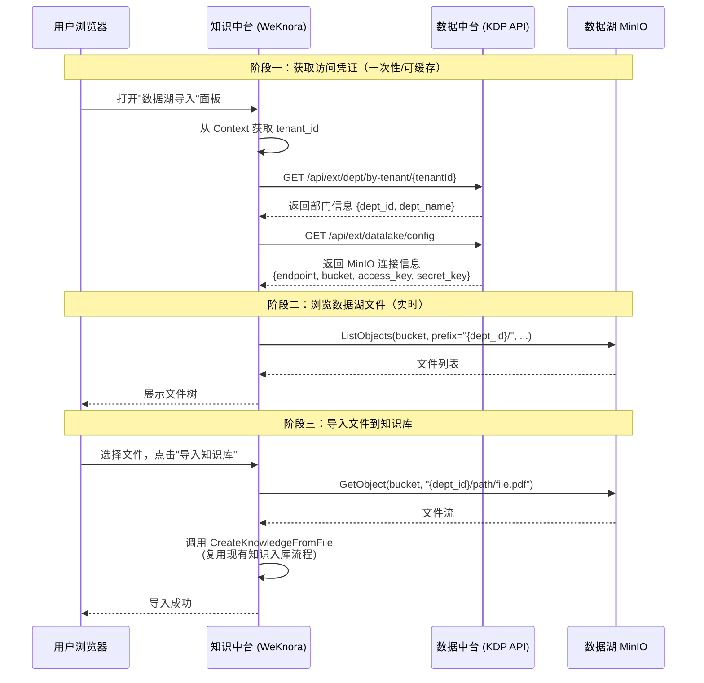

## 一、背景与目标

### 1.1 现状

| 维度             | 知识中台                             | 数据中台（KDP）                        |
| -------------- | -------------------------------- | -------------------------------- |
| **语言/框架**      | Go / Gin                         | Java / Spring Boot               |
| **用户体系**       | 租户(Tenant) + 用户(User)            | 部门(Dept) + 用户(SysUser)           |
| **文件存储**       | MinIO / 本地 / COS / TOS / S3（可配置） | MinIO（S3 协议，非结构化数据湖）             |
| **数据隔离**       | `tenant_id` 字段级隔离                | 部门文件夹路径隔离（`/{dept_id}/...`）      |
| **MinIO 权限模型** | 每个租户可配置独立 `MinIOEngineConfig`    | 按用户/部门分配文件夹，根目录列表只展示用户所属部门和自身文件夹 |


### 1.2 目标

> **在知识库入库流程中增加"从数据湖导入"选项，用户可以浏览当前租户在数据湖中对应部门的文件，选择文件导入到知识库。**

```
┌──────────────┐       API 调用        ┌──────────────┐
│   知识中台    │ ◄──── 获取部门信息 ──── │   数据中台    │
│              │ ◄── 获取 MinIO 凭证 ── │   (KDP)      │
│              │ ── 直连 MinIO 读文件 ─► │  MinIO 数据湖 │
└──────────────┘                        └──────────────┘

```


## 二、核心架构设计

### 2.1 整体数据流

下图展示了用户从"打开数据湖导入面板"到"文件成功入知识库"的完整交互时序。整个流程分为三个阶段：获取凭证、浏览文件、导入文件。

  


### 2.2 租户-部门映射关系

下图展示了映射关系的管理流程。映射数据存储在数据中台侧（KDP 的 `sys_dept` 表新增 `tenant_id` 字段），由 SaaS 平台在创建租户时写入。知识中台仅查询并缓存这个映射关系。

```mermaid

flowchart LR
    SaaS["SaaS 平台<br/>（创建租户）"]
    KDP_API["KDP API<br/>（创建部门 + 写入 tenant_id）"]
    KDP_DB[("KDP 数据库<br/>sys_dept 表<br/>tenant_id 字段")]
    WK["知识中台<br/>（查询映射 + 本地缓存）"]

    SaaS -->|1.创建租户| SaaS
    SaaS -->|2.调用KDP创建部门<br/>传入tenant_id| KDP_API
    KDP_API -->|3.写入数据| KDP_DB
    WK -->|4.查询映射<br/>GET /api/ext/dept/by-tenant/&#123;id&#125;| KDP_API
    KDP_API -->|5.读取数据| KDP_DB

```



  
## 三、数据中台研发计划

### 3.1 数据库改动：sys_dept 表新增 tenant_id 字段

```sql

-- 在 sys_dept 表新增 tenant_id 字段，用于关联 SaaS 租户

ALTER TABLE sys_dept ADD COLUMN tenant_id BIGINT DEFAULT NULL;

CREATE UNIQUE INDEX uk_dept_tenant_id ON sys_dept(tenant_id) WHERE tenant_id IS NOT NULL;

  

COMMENT ON COLUMN sys_dept.tenant_id IS 'SaaS 平台租户 ID，创建租户时由 SaaS 写入';

```

`Dept.java` 新增字段：

```java

@ApiModelProperty(value = "关联的SaaS租户ID")

Long tenant_id;

```

### 3.2 新增接口一：根据租户 ID 查询关联部门

**路径：** `GET /api/ext/dept/by-tenant/{tenantId}`
  
**认证方式：** `X-API-Key` Header（服务间 API Key）

**响应示例：**

```json

{

  "code": 200,

  "data": {

    "dept_id": "1001",

    "dept_name": "研发部",

    "belong": null,

    "tenant_id": 1,

    "minio_path": "/1000/1001/"

  }

}

```


**实现方式：**

1. 执行 `SELECT * FROM sys_dept WHERE tenant_id = #{tenantId}`
2. 代码中调用已有的 `DeptServiceImpl.getParentPathFromBelong(dept.getBelong())` 构建并拼接完整的部门路径（如包含父级： `/祖级部门ID/当前部门ID/`），并通过 `minio_path` 返回。知识中台将强制使用这个全路径进行文件检索。

  
### 3.3 新增接口二：获取数据湖 MinIO 配置

>使用同一个对象存储，可不加该接口

**路径：** `GET /api/ext/datalake/config`
**认证方式：** `X-API-Key` Header
**响应示例：**

```json

{

  "code": 200,

  "data": {

    "endpoint": "http://minio:9000",

    "bucket": "kdp",

    "access_key": "minioadmin",

    "secret_key": "minioadmin"

  }

}

```
  
**实现方式：** 查询 `DataSourceSsd` 表中 `sys_label = 'LAKE'` 且 `datasource_type = 'UNSTRUCTURED'` 的记录，返回连接信息。

### 3.4 创建部门时支持传入 tenant_id

SaaS 平台调用 `DeptController.addDept()` 创建部门时，在请求体中携带 `tenant_id`，KDP 直接存入即可。


## 四、知识中台改造方案

### 4.1 新增模块：`internal/kdp/`

下面是新增 KDP 集成模块的目录结构及各文件职责说明：
  
```

internal/kdp/

├── client.go              # KDP API 客户端（HTTP 调用 + 响应解析）

├── types.go               # 数据类型定义（DataLakeConfig / DataLakeFile / DeptInfo）

├── config.go              # KDP 集成配置（Enabled / BaseURL / APIKey 等）

├── datalake.go            # 数据湖 MinIO 操作封装（ListFiles / GetFileStream）

└── cache.go               # 配置缓存（DataLakeConfig + DeptInfo 缓存）

```

#### 4.1.1 配置定义

```go

// internal/kdp/config.go

package kdp

  

type Config struct {

    Enabled    bool   `yaml:"enabled" json:"enabled"`       // 是否启用 KDP 集成

    BaseURL    string `yaml:"base_url" json:"base_url"`     // KDP API 地址

    APIKey     string `yaml:"api_key" json:"api_key"`       // 服务间 API Key

    Timeout    int    `yaml:"timeout" json:"timeout"`       // 超时（秒），默认 30

    CacheTTL   int    `yaml:"cache_ttl" json:"cache_ttl"`   // 缓存时间（秒），默认 300

}

```
  
对应环境变量：

```env

# 数据中台（KDP）集成配置

KDP_ENABLED=false

KDP_BASE_URL=http://kdp-server:8080

KDP_API_KEY=your_kdp_api_key

KDP_TIMEOUT=30

KDP_CACHE_TTL=300

```

#### 4.1.2 核心类型

```go

// internal/kdp/types.go

package kdp

import "time"

// DeptInfo KDP 部门信息（从 KDP 接口获取）

type DeptInfo struct {

    DeptID    string `json:"dept_id"`

    DeptName  string `json:"dept_name"`

    Belong    string `json:"belong"`

    TenantID  uint64 `json:"tenant_id"`

    MinIOPath string `json:"minio_path"` // 包含父层级的部门完整物理前缀，决定了真实访问的作用域

}  

// DataLakeConfig 数据湖 MinIO 配置（从 KDP 获取）

type DataLakeConfig struct {

    Endpoint  string `json:"endpoint"`

    Bucket    string `json:"bucket"`

    AccessKey string `json:"access_key"`

    SecretKey string `json:"secret_key"`

}

// DataLakeFile 数据湖文件信息

type DataLakeFile struct {

    Name       string     `json:"name"`

    IsDir      bool       `json:"is_dir"`

    Path       string     `json:"path"`

    FullPath   string     `json:"full_path"`

    Size       int64      `json:"size"`

    Type       string     `json:"type"`

    ModifiedAt *time.Time `json:"modified_at"`

}

```

#### 4.1.3 KDP 客户端

```go

// internal/kdp/client.go

package kdp

  

// Client KDP API 客户端

type Client struct {

    baseURL    string

    apiKey     string

    httpClient *http.Client

    cache      *configCache  // DataLakeConfig + DeptInfo 缓存

}

  

// GetDeptByTenantID 根据租户ID查询关联部门（带缓存）

func (c *Client) GetDeptByTenantID(ctx context.Context, tenantID uint64) (*DeptInfo, error)

// 内部调用：GET {baseURL}/api/ext/dept/by-tenant/{tenantID}

  

// GetDataLakeConfig 获取数据湖 MinIO 配置（带缓存）

func (c *Client) GetDataLakeConfig(ctx context.Context) (*DataLakeConfig, error)

// 内部调用：GET {baseURL}/api/ext/datalake/config

```

#### 4.1.4 数据湖操作封装

```go

// internal/kdp/datalake.go

package kdp

  

// DataLakeClient 数据湖文件操作（内部管理 MinIO 连接）

type DataLakeClient struct {

    kdpClient *Client

    mu        sync.Mutex

    minio     *minio.Client  // 懒初始化，凭证变更时自动刷新

}

// ListFiles 列出部门路径下的文件

// minioPath: 完整的部门前缀路径（如：/1000/1001/），从 DeptInfo 中取得

// subPath: 部门内的用户相对路径（如 "/" 或 "/子目录/"）

func (d *DataLakeClient) ListFiles(ctx context.Context, minioPath, subPath, nameFilter string, page, pageSize int) ([]DataLakeFile, int, error)

// GetFileStream 获取文件流（用于导入知识库）

// fullFilePath 已经是由前端选定基于 minioPath 的实际完整绝对路径

// 返回：文件流, 文件名, 文件大小, error

func (d *DataLakeClient) GetFileStream(ctx context.Context, fullFilePath string) (io.ReadCloser, string, int64, error)

// CheckConnection 检查数据湖连接状态

func (d *DataLakeClient) CheckConnection(ctx context.Context) error

```

  
### 4.2 新增后端 API

#### 4.2.1 数据湖文件浏览与导入接口

| 接口        | 方法   | 路径                                                | 说明                |
| --------- | ---- | ------------------------------------------------- | ----------------- |
| 浏览数据湖文件   | POST | `/api/v1/datalake/files`                          | 列出当前租户部门下的文件      |
| 获取数据湖文件流  | POST | `/api/v1/datalake/download`                       | 用于文件预览/下载         |
| 从数据湖导入知识库 | POST | `/api/v1/knowledge-bases/{id}/knowledge/datalake` | 选择数据湖文件导入知识库      |
| 数据湖连接状态   | GET  | `/api/v1/datalake/status`                         | 检查数据湖是否可用、是否已配置映射 |


**核心接口详细设计：**

**POST /api/v1/datalake/files** — 浏览数据湖文件

```json

// Request

{

    "path": "/",              // 部门内相对路径，默认 "/"

    "name_filter": "",        // 文件名搜索关键字

    "page": 1,

    "page_size": 20

}

// Response

{

    "success": true,

    "data": {

        "dept_id": "1001",

        "dept_name": "研发部",

        "current_path": "/",

        "files": [

            {

                "name": "项目文档",

                "is_dir": true,

                "path": "/",

                "full_path": "/项目文档/",

                "size": 0,

                "type": "文件夹",

                "modified_at": null

            },

            {

                "name": "需求说明书.pdf",

                "is_dir": false,

                "path": "/",

                "full_path": "/需求说明书.pdf",

                "size": 1048576,

                "type": "pdf",

                "modified_at": "2026-04-01T10:00:00Z"

            }

        ],

        "total": 2

    }

}

```


> [!NOTE]

> `full_path` 是部门内的相对路径，不包含 `{dept_id}` 前缀。后端会自动拼接 `{dept_id} + full_path` 作为 MinIO 的实际 object prefix。这样前端不需要知道 dept_id 的存在。

**POST /api/v1/knowledge-bases/{id}/knowledge/datalake** — 从数据湖导入

```json

// Request

{

    "files": [

        {

            "full_path": "/项目文档/需求说明书.pdf",

            "file_name": "需求说明书.pdf"

        },

        {

            "full_path": "/技术方案.docx",

            "file_name": "技术方案.docx"

        }

    ],

    "tag_id": "",

    "channel": "datalake"

}  

// Response

{

    "success": true,

    "data": {

        "imported": 2,

        "failed": 0,

        "results": [

            {"file": "需求说明书.pdf", "knowledge_id": "xxx", "status": "success"},

            {"file": "技术方案.docx", "knowledge_id": "yyy", "status": "success"}

        ]

    }

}

```

  
**GET /api/v1/datalake/status** — 连接状态检查

```json

// Response（已配置且可用）

{

    "success": true,

    "data": {

        "enabled": true,

        "connected": true,

        "dept_id": "1001",

        "dept_name": "研发部"

    }

}

// Response（当前租户未关联部门）

{

    "success": true,

    "data": {

        "enabled": true,

        "connected": false,

        "message": "当前租户未关联数据中台部门"

    }

}

```

### 4.3 前端改造

#### 4.3.1 知识入库页面 — 增加"从数据湖导入"入口


在现有的知识库详情页的"添加知识"下拉菜单中，新增一个选项。只有在 `GET /api/v1/datalake/status` 返回 `enabled && connected` 时才显示此选项：

```

┌─────────── 添加知识 ▼ ────────────┐

│  📄 从文件上传                      │

│  🔗 从 URL 导入                    │

│  ✏️  手工录入                      │

│  ─────────────────────────        │

│  🏢 从数据湖导入  ← 新增入口       │

└──────────────────────────────────┘

```
#### 4.3.2 数据湖文件选择对话框

点击"从数据湖导入"后弹出文件浏览和选择对话框。支持目录浏览、面包屑导航、多选和文件名搜索：

```

┌─────────── 从数据湖导入 ──────────────────────────┐

│                                                     │

│  📁 研发部 (部门: 1001)                             │

│  ──────────────────────────────────────             │

│  路径: / > 项目文档 >                               │

│                                                     │

│  🔍 搜索文件名 ...                                  │

│                                                     │

│  ☑️ 📄 需求说明书.pdf         1.2 MB    2026-04-01  │

│  ☐  📄 技术方案.docx          856 KB    2026-03-28  │

│  ☐  📁 子目录                  --       --          │

│  ☑️ 📄 接口文档.md            120 KB    2026-03-25  │

│                                                     │

│  已选择 2 个文件                                     │

│                                                     │

│              [ 取消 ]   [ 导入到知识库 ]              │

└─────────────────────────────────────────────────────┘

```

**涉及前端文件：**
  
| 文件                                                     | 操作     | 说明                  |
| ------------------------------------------------------ | ------ | ------------------- |
| `frontend/src/api/datalake.ts`                         | **新增** | 数据湖 API 接口定义        |
| `frontend/src/views/knowledge/DataLakeImportModal.vue` | **新增** | 数据湖文件选择弹窗组件         |
| 知识库详情页（添加知识按钮处）                                        | 修改     | 添加"从数据湖导入"入口 + 条件显示 |

  

